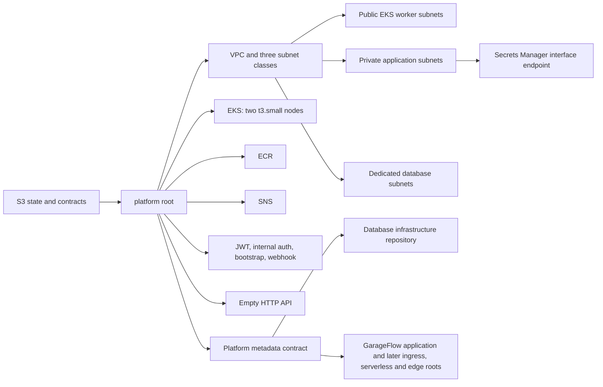

# GarageFlow Platform Infrastructure

This repository defines three independently testable Phase 3 roots: platform, private ingress and public edge. They own the shared AWS network, EKS, ECR, SNS, application secrets, internal ALB and API Gateway configuration. The code has credential-free local tests; local verification does not demonstrate a live deployment.



The `homologation` and `production` environments have separate names, VPC CIDRs, secrets, resources, concurrency groups, and state keys. `develop` deploys only `homologation`; `main` deploys only `production`. The platform state is stored at `phase3/{environment}/platform.tfstate`. The same protected `TF_STATE_BUCKET` holds versioned public metadata under `contracts/v1/{environment}/platform/...`; contracts contain resource IDs, URLs, and ARNs, never secret values.

## Current ownership

The platform creates two public subnets for EKS workers, two private application subnets, and two dedicated database subnets across the first two available `us-east-1` availability zones. Private subnets have explicit route tables with only the implicit VPC-local route. There is no NAT gateway and no assumption that placing future Lambda functions in public subnets provides egress. A private-DNS Secrets Manager interface endpoint is attached to the application subnets for later VPC functions.

EKS uses pre-existing Academy roles and two on-demand `t3.small` nodes with standard support policy. This repository does not create IAM roles. The platform root leaves its HTTP API empty; the separate edge root adds its VPC Link, integrations, authorizer, explicit routes and stage. Lambda functions and invoke permissions belong to the serverless repository. RDS and its credential secret belong exclusively to [garageflow-infra-database](https://github.com/DiegoRugue/garageflow-infra-database). The application remains in [GarageFlow](https://github.com/DiegoRugue/GarageFlow).

## Configuration

Terraform is pinned to 1.15.7, AWS provider 6.49.0, and random provider 3.9.0. Copy `infra/platform/terraform.tfvars.example` outside the repository's tracked files and supply:

| Variable | Purpose |
| --- | --- |
| `environment` | `homologation` or `production` |
| `owner`, `expires_on` | Academy ownership and cleanup tags |
| `eks_cluster_role_arn`, `eks_node_role_arn` | Pre-existing roles in the active Academy account |
| `kubernetes_version` | EKS version, default `1.36`; deploy preflight requires standard support |
| `bootstrap_admin_email` | Email stored in the bootstrap secret |
| `notification_email` | SNS email subscription endpoint |
| `public_access_cidrs` | Persistent operator/control IPv4 CIDRs allowed to reach the EKS API |

Bootstrap the retained/versioned state bucket only when it does not already exist:

```bash
terraform -chdir=infra/bootstrap/state-backend init -backend=false
terraform -chdir=infra/bootstrap/state-backend plan -var-file=/secure/path/backend.tfvars
terraform -chdir=infra/bootstrap/state-backend apply -var-file=/secure/path/backend.tfvars
```

For credential-free local validation:

```bash
python -m pip install --require-hashes --requirement requirements-test.txt
COVERAGE_FILE=/tmp/garageflow-platform-contract.coverage python -m coverage run --source=scripts --omit="scripts/tests/*" -m unittest discover -s scripts/tests -v
COVERAGE_FILE=/tmp/garageflow-platform-contract.coverage python -m coverage report --fail-under=80
python -m unittest discover -s tests -v
terraform fmt -check -recursive infra
terraform -chdir=infra/bootstrap/state-backend init -backend=false -input=false
terraform -chdir=infra/bootstrap/state-backend validate
terraform -chdir=infra/platform init -backend=false -input=false
terraform -chdir=infra/platform validate
terraform -chdir=infra/platform test
bash -n scripts/deploy-platform.sh
```

The shared `scripts/infra_contract.py`, its tests, and the versioned JSON schema are distributed from the public metadata-contract implementation. The deploy script passes the flat result of `terraform output -json deployment_outputs` to that CLI.

## CI and deployment

`quality-gate.yml` runs the Python contract and repository-policy tests, Terraform formatting, offline initialization, validation, mock tests, and shell syntax checks for pull requests and pushes to `develop` or `main`.

`deploy.yml` repeats the same quality gate for the exact trusted commit and only then deploys a push or manual recovery run whose ref is exactly `develop` or `main`. Configure matching GitHub Environments named `homologation` and `production` with these values:

- Secrets: `AWS_ACCESS_KEY_ID`, `AWS_SECRET_ACCESS_KEY`, `AWS_SESSION_TOKEN`, `TF_STATE_BUCKET`, `EKS_CLUSTER_ROLE_ARN`, `EKS_NODE_ROLE_ARN`.
- Variables: `TF_OWNER`, `TF_EXPIRES_ON`, `BOOTSTRAP_ADMIN_EMAIL`, `SNS_NOTIFICATION_EMAIL`, `EKS_PUBLIC_ACCESS_CIDRS` as a JSON string array, and optionally `EKS_VERSION`.
- Additional protected variable for ingress/edge deployment: `AWS_ACCOUNT_ID`, matched against STS and all contract ARNs.

The deployment performs live STS account matching, EKS support and zonal `t3.small` offering checks. Before Terraform planning, it obtains the current trusted hosted runner's egress address over HTTPS, validates that it is a globally routable IPv4 address, and appends its exact `/32` to the configured operator/control CIDRs. The configured CIDRs remain intact. If the address cannot be determined and validated, deployment stops before planning or applying; it never substitutes a wide-open CIDR. Each later deployment recalculates the runner `/32`, so a new hosted runner replaces the previous transient runner entry while preserving the Environment configuration.

After that preflight, the script initializes the environment-specific backend, applies the exact saved plan from `RUNNER_TEMP`, waits for an active cluster, and polls Kubernetes with a bounded per-request timeout until two nodes are Ready. Transient Kubernetes API failures are retried until the overall deadline; persistent failures stop contract publication with the last request outcome. Only after readiness does it validate the contract and publish its immutable revision before the stable key. This code is under review and has credential-free local coverage; no live Phase 3 deployment is claimed.

AWS Academy credentials and resources are temporary and the working session lasts about four hours. Prepare and pass all local checks before starting a session, refresh each Environment's temporary credentials, and leave enough time for EKS provisioning and verification. Live provisioning, state migration from Phase 2, repository protection, and remote publication are separate coordinated operations; local validation does not perform them.

The shared contract utility restricts input and output paths to RUNNER_TEMP, or the operating system temporary directory when RUNNER_TEMP is absent. Relative paths resolve inside that directory; absolute paths and resolved symlinks must stay within it. Test dependencies, including transitive packages, are pinned with hashes in requirements-test.txt.

## Private ingress and public edge

Provision in this order: **platform → database and ingress → application → serverless → edge**. The platform workflow reconciles ingress after platform readiness. The serverless pipeline calls the reusable platform edge workflow after successful alias deployment, using the matching protected branch and inherited Environment settings. `Deploy Private Ingress or Edge` also accepts manual `ingress` or `edge` recovery runs on protected branches; it has no independent push trigger. Edge checks that deployed aliases use the current platform secrets, ingress address and network, and that application targets are healthy. Its quality gate records the exact platform commit, which the deploy job checks out. Separate Terraform state keys are `phase3/{environment}/ingress.tfstate` and `phase3/{environment}/edge.tfstate`.

Ingress publishes `contracts/v2/{environment}/ingress.json`, preceded by an immutable revision. Platform, database and serverless metadata remain version 1. Version 2 explicitly declares `transport=http` and the authentication/VPC Link security groups; it omits `tlsServerName`. Version 1 ingress still requires HTTPS, so old consumers fail closed instead of silently downgrading transport.

The internal ALB accepts port 80 only from the authentication Lambda and VPC Link security groups. It forwards to EKS worker NodePort 30080; that port accepts only the ALB security group. The authentication function can additionally reach port 443 inside the VPC for the existing Secrets Manager endpoint. No NAT, ingress controller, custom domain or ACM certificate is required. Terraform registers the managed node group's Auto Scaling groups with the target group. Reconcile ingress whenever EKS replaces a managed node group/ASG. Ingress publication checks resource availability; the later application deployment checks healthy targets after its NodePort workload is ready.

Public clients use HTTPS at the managed execute-api endpoint. **The private HTTP hop is unencrypted inside the VPC.** Source security groups restrict reachability and the internal credential verifier additionally requires a short-lived service JWT with a separate signing key. This Academy tradeoff is not equivalent to end-to-end TLS.

The edge consumes platform v1, ingress v2 and serverless v1. The reviewed catalog in `infra/edge/routes.json` exposes 65 explicit routes. Only staff login, customer token issuance and the existing HMAC-protected estimate webhook omit the Lambda authorizer. Other routes require a valid user JWT; the API remains responsible for roles, password-change requirements, customer status and order ownership. Authorizer caching is disabled. Internal verification, probes, API documentation and catch-all routes are absent. Access logs include only request ID, route key, status and latency. Defaults are 20 requests/second with burst 40; login routes use 5/second with burst 10.

Run additional root checks locally:

```bash
for root in ingress edge; do
  terraform -chdir="infra/${root}" init -backend=false -input=false
  terraform -chdir="infra/${root}" validate
  terraform -chdir="infra/${root}" test
done
bash -n scripts/deploy-ingress.sh scripts/deploy-edge.sh scripts/deploy-edge-component.sh
```

## New Relic observability

The opt-in `Deploy Observability` workflow runs after platform deployment and can also be dispatched from `main` (production) or `develop` (homologation). It uses the protected environment and the exact commit checked by the quality gate. Set `NEW_RELIC_ENABLED=true` only after reviewing live node capacity and merging the collector configuration. An absent flag skips installation. Set protected variables `NEW_RELIC_ACCOUNT_ID` (production: `8506965`), `NEW_RELIC_REGION=US`, and `AWS_ACCOUNT_ID`, plus the existing AWS credentials/state bucket and the environment secret `NEW_RELIC_LICENSE_KEY`.

Collection uses the official `nr-k8s-otel-collector` chart **0.14.2**, verified against its SHA-256, with NRDOT **1.19.0**, kube-state-metrics chart **8.1.3**, and a pinned Kubernetes **1.36.0** init utility image. Helm **3.19.0** installs one deployment and one collector per node in `newrelic`. The collectors use read-only Kubernetes discovery permissions and export HTTP/protobuf through HTTPS/443 to `https://otlp.nr-data.net`. They require existing outbound connectivity; installation creates no NAT, public receiver, or Lambda instrumentation. See [the architecture decision](docs/adr/0001-newrelic-opentelemetry.md).

The API contract is `Observability__Enabled=true` and `Observability__OtlpEndpoint=http://garageflow-otel.newrelic.svc.cluster.local:4318`, with service name `garageflow-api`. Enable the API only after the collector is ready. The ClusterIP receiver accepts traces, metrics and logs; API logs arrive through OTLP only. File log pipelines and Kubernetes event collection are disabled. No ingestion key belongs in API configuration. Namespace, pod, node, cluster and environment attributes enrich application telemetry. Keep sensitive payloads, credentials and identifiers out of application telemetry at the source.

The daemonset's cloud-provider resource detector is restricted to the local `env` detector. Automatic EC2/EKS cloud discovery can require AWS credentials and abort collector startup in Academy environments. Kubernetes receivers and metadata processors still provide pod/node identity, and the configured chart cluster name remains attached. Automatic cloud provider, account, region, instance and cloud resource-ID enrichment is not promised. Do not add AWS credentials to collector pods or expand IAM, instance metadata access or network routes for this enrichment.

The ingestion key is passed only to Kubernetes Secret creation through stdin, using server-side apply without a last-applied annotation. It is excluded from child environments, Helm values/release history, Terraform state and command/error output. The referenced Secret stays outside Helm ownership. Successful upgrades restart collectors to pick up key rotations. The workflow temporarily adds the actual runner IPv4 `/32` to a scoped EKS endpoint configuration and uses a temporary kubeconfig. Cleanup waits for submitted EKS updates and restores the original endpoint configuration only if it still matches the owned grant. A concurrent change or an unknown submission outcome preserves the lease and fails rather than overwriting access. An `always()` step retries cleanup; inspect the EKS update and reconcile the retained runner lease if credentials expire, a run is forcibly terminated, or another deploy modifies the endpoint concurrently.

For two nodes, steady requests are **480 MiB and 325m CPU**, and limits are **704 MiB and 1600m CPU**. Rolling deployment and kube-state-metrics updates can add up to **320 MiB and 600m CPU** in limits. DaemonSet init containers inherit the daemonset budget. These are bounded initial settings, not evidence that existing nodes have sufficient headroom. Review per-node allocatable resources, existing requests, actual memory, pod slots and rollout placement before enabling; do not increase node counts or alter application HPA targets as part of this install. Collectors use memory limiting, Go memory targets, batching, a 64-batch export queue and retries capped at 60 seconds. Backend failure can discard telemetry; it must not block business operations.

Render a dashboard to an external path and import its JSON in New Relic. The technical dashboard remains the default:

```bash
python scripts/render_observability_dashboard.py --account-id 8506965 --environment production --output /tmp/garageflow-dashboard.json
python scripts/render_observability_dashboard.py --dashboard business --account-id 8506965 --environment production --output /tmp/garageflow-business-dashboard.json
```

The technical template has six API data widgets and two node CPU/memory data widgets, with Portuguese titles and a reading guide on each page. HTTP percentiles are converted from seconds to milliseconds after aggregation. Request logs display the structured `Method`, `Route`, `StatusCode` and `DurationMs` attributes alongside trace/span IDs; only records with method and route are shown, without interpolating the message template. Node percentage widgets use the chart's generated utilization ratios multiplied by 100. Use New Relic's Kubernetes navigator for pods, deployments, restarts and HPA views. Import/render validation does not prove ingestion or query results. After merged deployment, verify one real request with correlated log/trace, HTTP duration metrics, both nodes and pod metrics, then compare memory/CPU and exporter errors with a baseline. Loss of telemetry is not proof of uptime; health checks and external availability need separate validation. Lambda internals remain outside these dashboards.

The business template places daily creation and eligible completion volumes side by side, above a full-width daily summary with mean execution minutes and the successful refresh start time. A visible reading guide explains the reporting window and missing samples. Means use a table because a bar visualization can render missing values as zero; empty means remain distinct from recorded zero durations. It covers today and the preceding six civil dates in `America/Sao_Paulo`; today is partial. Creation volume is grouped by `CreatedAt`. Completion count and duration are grouped by `CompletedAt`, using UTC bounds converted from each business date with an inclusive start and exclusive end. Each work order counts once, regardless of its service lines. Only `Completed` or `Delivered` work orders with both timestamps and `CompletedAt >= StartedAt` contribute to the mean of `CompletedAt - StartedAt`. No eligible work orders means count zero and an absent mean; genuinely equal timestamps produce zero minutes. Diagnosis, approval wait, pickup wait, integration failures, alerts and uptime require separate indicators. The existing per-service average retains its own meaning.

When API observability is enabled, its `GarageFlow.WorkOrders` meter publishes these database snapshots at startup and every five minutes over the existing OTLP path:

| Gauge | Meaning | Unit |
| --- | --- | --- |
| `garageflow.work_orders.created` | Work orders created on the business date | Work orders |
| `garageflow.work_orders.completed` | Eligible work orders completed on the business date | Work orders |
| `garageflow.work_orders.duration.mean` | Mean elapsed completion; omitted without samples | Seconds |
| `garageflow.work_orders.snapshot.timestamp` | Start time of the last successful refresh | Unix seconds |

The only business dimensions are `work_orders.date` and `work_orders.timezone`, alongside existing service, environment and instance resource attributes. The queries filter service and environment, use `latest(...)` per `work_orders.date`, and limit the result to seven dates. Summing or averaging snapshots across replicas or export intervals would distort the counts and means. The mean query divides seconds by 60 and returns null when the latest eligible count is zero. The freshness table converts Unix seconds to milliseconds for `toDatetime` and displays Sao Paulo local time. These expressions follow the [NRQL function reference](https://docs.newrelic.com/docs/nrql/nrql-syntax-clauses-functions/) and [dimensional metric query guidance](https://docs.newrelic.com/docs/data-apis/understand-data/metric-data/query-metric-data-type/).

`SINCE 15 minutes ago` is a telemetry capture window, not a fifteen-minute business period. Business data widgets ignore the dashboard time picker to preserve this fixed capture window; the technical dashboard follows the selected time range. The publisher suppresses snapshots older than ten minutes, but previously ingested samples remain visible within the capture window. Check the refresh timestamp before interpreting a chart; an empty chart is not proof of zero business activity. Around midnight, the capture window can briefly include eight dates. `FACET work_orders.date ORDER BY max(garageflow.work_orders.snapshot.timestamp) LIMIT 7` selects the seven dates from the newest successfully refreshed batch, keeping an older date from displacing today. This maximum only ranks date facets; displayed counts and means still use `latest`. All seven dates share the start time of their successful refresh, and the reporting date is derived from that same instant. A batch started before midnight therefore ranks below one started after midnight even if they finish out of order. Before the first post-midnight refresh arrives, the last available batch remains visible with its original refresh timestamp. Validate dashboard queries in New Relic after the application version containing these gauges is deployed, including known zero-sample dates, real zero durations and multiple replicas, then compare the values against persisted work orders. Rendering this file alone does not prove ingestion or production acceptance.

Useful initial queries (select the intended New Relic account):

```sql
FROM Span SELECT count(*) WHERE service.name = 'garageflow-api' FACET deployment.environment.name SINCE 30 minutes ago
FROM Log SELECT count(*) WHERE service.name = 'garageflow-api' FACET deployment.environment.name SINCE 30 minutes ago
FROM Metric SELECT average(node.memory.usage.percentage) * 100 WHERE k8s.cluster.name = 'garageflow-production' FACET k8s.node.name TIMESERIES
```
