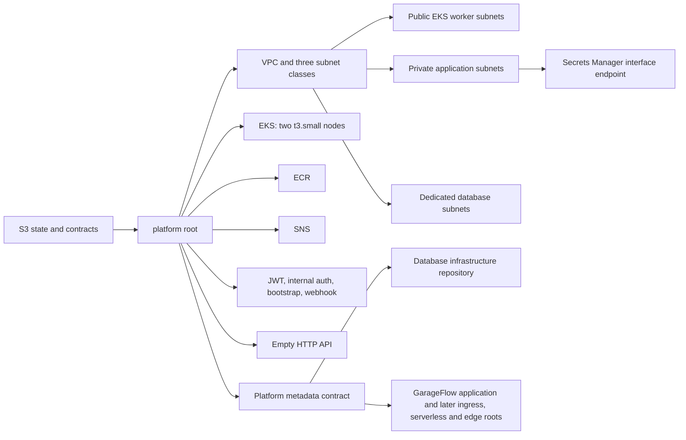

# GarageFlow Platform Infrastructure

This repository defines the first independently testable Phase 3 platform root for GarageFlow. It owns the shared AWS network, EKS cluster, ECR repository, SNS topic, application-level secrets, a private Secrets Manager endpoint, and the HTTP API resource that later edge infrastructure will configure. The code has credential-free local tests; this repository does not claim that these resources are currently deployed.



The `homologation` and `production` environments have separate names, VPC CIDRs, secrets, resources, concurrency groups, and state keys. `develop` deploys only `homologation`; `main` deploys only `production`. The platform state is stored at `phase3/{environment}/platform.tfstate`. The same protected `TF_STATE_BUCKET` holds versioned public metadata under `contracts/v1/{environment}/platform/...`; contracts contain resource IDs, URLs, and ARNs, never secret values.

## Current ownership

The platform creates two public subnets for EKS workers, two private application subnets, and two dedicated database subnets across the first two available `us-east-1` availability zones. Private subnets have explicit route tables with only the implicit VPC-local route. There is no NAT gateway and no assumption that placing future Lambda functions in public subnets provides egress. A private-DNS Secrets Manager interface endpoint is attached to the application subnets for later VPC functions.

EKS uses pre-existing Academy roles and two on-demand `t3.small` nodes with standard support policy. This repository does not create IAM roles. The HTTP API intentionally has no routes, integrations, stages, or authorizers yet. Ingress, private TLS, VPC Link, Lambda functions, and edge routes remain with the later components defined by the architecture RFC. RDS and its credential secret belong exclusively to the verified [garageflow-infra-database](https://github.com/DiegoRugue/garageflow-infra-database) repository. The application remains in [GarageFlow](https://github.com/DiegoRugue/GarageFlow).

## Configuration

Terraform is pinned to 1.15.7, AWS provider 6.49.0, and random provider 3.9.0. Copy `infra/platform/terraform.tfvars.example` outside the repository's tracked files and supply:

| Variable | Purpose |
| --- | --- |
| `environment` | `homologation` or `production` |
| `owner`, `expires_on` | Academy ownership and cleanup tags |
| `eks_cluster_role_arn`, `eks_node_role_arn` | Pre-existing roles in the active Academy account |
| `kubernetes_version` | EKS version, default `1.36`; deploy preflight requires standard support |
| `bootstrap_admin_email` | Email stored in the bootstrap secret |
| `notification_email` | SNS email subscription endpoint |
| `public_access_cidrs` | Persistent operator/control IPv4 CIDRs allowed to reach the EKS API |

Bootstrap the retained/versioned state bucket only when it does not already exist:

```bash
terraform -chdir=infra/bootstrap/state-backend init -backend=false
terraform -chdir=infra/bootstrap/state-backend plan -var-file=/secure/path/backend.tfvars
terraform -chdir=infra/bootstrap/state-backend apply -var-file=/secure/path/backend.tfvars
```

For credential-free local validation:

```bash
python -m pip install --require-hashes --requirement requirements-test.txt
COVERAGE_FILE=/tmp/garageflow-platform-contract.coverage python -m coverage run --source=scripts --omit="scripts/tests/*" -m unittest discover -s scripts/tests -v
COVERAGE_FILE=/tmp/garageflow-platform-contract.coverage python -m coverage report --fail-under=80
python -m unittest discover -s tests -v
terraform fmt -check -recursive infra
terraform -chdir=infra/bootstrap/state-backend init -backend=false -input=false
terraform -chdir=infra/bootstrap/state-backend validate
terraform -chdir=infra/platform init -backend=false -input=false
terraform -chdir=infra/platform validate
terraform -chdir=infra/platform test
bash -n scripts/deploy-platform.sh
```

The shared `scripts/infra_contract.py`, its tests, and the versioned JSON schema are distributed from the public metadata-contract implementation. The deploy script passes the flat result of `terraform output -json deployment_outputs` to that CLI.

## CI and deployment

`quality-gate.yml` runs the Python contract and repository-policy tests, Terraform formatting, offline initialization, validation, mock tests, and shell syntax checks for pull requests and pushes to `develop` or `main`.

`deploy.yml` repeats the same quality gate for the exact trusted commit and only then deploys a push or manual recovery run whose ref is exactly `develop` or `main`. Configure matching GitHub Environments named `homologation` and `production` with these values:

- Secrets: `AWS_ACCESS_KEY_ID`, `AWS_SECRET_ACCESS_KEY`, `AWS_SESSION_TOKEN`, `TF_STATE_BUCKET`, `EKS_CLUSTER_ROLE_ARN`, `EKS_NODE_ROLE_ARN`.
- Variables: `TF_OWNER`, `TF_EXPIRES_ON`, `BOOTSTRAP_ADMIN_EMAIL`, `SNS_NOTIFICATION_EMAIL`, `EKS_PUBLIC_ACCESS_CIDRS` as a JSON string array, and optionally `EKS_VERSION`.

The deployment performs live STS account matching, EKS support and zonal `t3.small` offering checks. Before Terraform planning, it obtains the current trusted hosted runner's egress address over HTTPS, validates that it is a globally routable IPv4 address, and appends its exact `/32` to the configured operator/control CIDRs. The configured CIDRs remain intact. If the address cannot be determined and validated, deployment stops before planning or applying; it never substitutes a wide-open CIDR. Each later deployment recalculates the runner `/32`, so a new hosted runner replaces the previous transient runner entry while preserving the Environment configuration.

After that preflight, the script initializes the environment-specific backend, applies the exact saved plan from `RUNNER_TEMP`, waits for an active cluster, and polls Kubernetes with a bounded per-request timeout until two nodes are Ready. Transient Kubernetes API failures are retried until the overall deadline; persistent failures stop contract publication with the last request outcome. Only after readiness does it validate the contract and publish its immutable revision before the stable key. This code is under review and has credential-free local coverage; no live Phase 3 deployment is claimed.

AWS Academy credentials and resources are temporary and the working session lasts about four hours. Prepare and pass all local checks before starting a session, refresh each Environment's temporary credentials, and leave enough time for EKS provisioning and verification. Live provisioning, state migration from Phase 2, repository protection, and remote publication are separate coordinated operations; local validation does not perform them.

The shared contract utility restricts input and output paths to RUNNER_TEMP, or the operating system temporary directory when RUNNER_TEMP is absent. Relative paths resolve inside that directory; absolute paths and resolved symlinks must stay within it. Test dependencies, including transitive packages, are pinned with hashes in requirements-test.txt.
