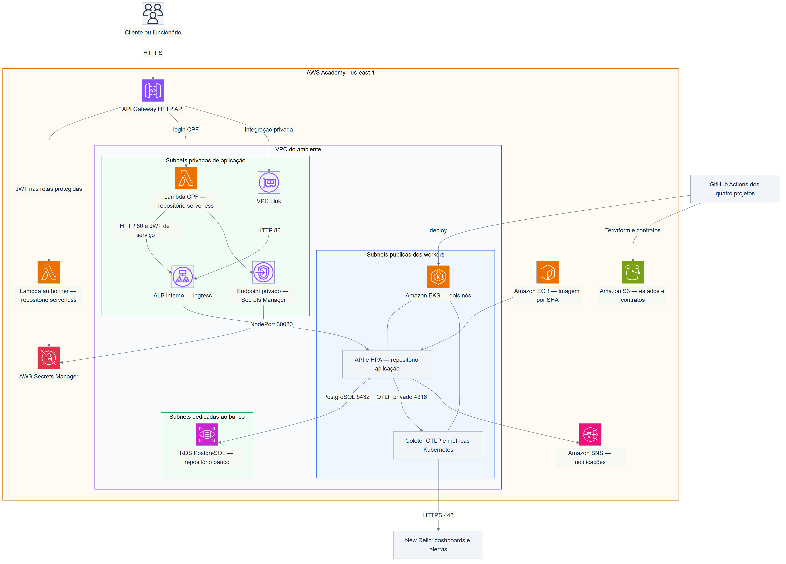
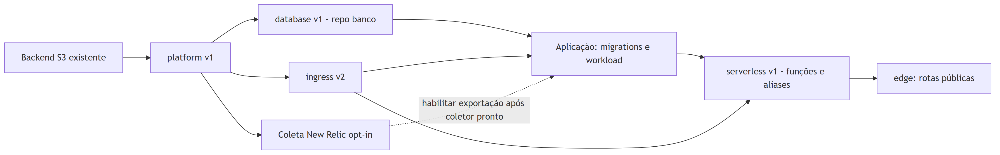

# GarageFlow — Plataforma Kubernetes

Este README é a documentação principal da infraestrutura compartilhada, rede, entrada da API e observabilidade. Três módulos raiz (roots) Terraform independentes compõem a plataforma: `platform`, `ingress` e `edge`. A operação detalhada e os parâmetros dos artefatos estão nas seções abaixo.

## Sumário

- [Visão de componentes na nuvem](#visão-de-componentes-na-nuvem)
- [Responsabilidade dos artefatos](#responsabilidade-dos-artefatos)
- [Rede e escalabilidade](#rede-e-escalabilidade)
- [Ordem de deploy e contratos](#ordem-de-deploy-e-contratos)
- [Acesso e documentação das APIs](#acesso-e-documentação-das-apis)
- [Configuração](#configuração)
- [Integração contínua e implantação](#integração-contínua-e-implantação)
- [Entrada privada e borda pública](#entrada-privada-e-borda-pública)
- [Observabilidade com New Relic](#observabilidade-com-new-relic)

## Visão de componentes na nuvem

Este é o diagrama integrado da Fase 3. Os componentes externos a este repositório estão identificados; cada README detalha seus próprios artefatos.



[Fonte editável do diagrama](docs/diagrams/cloud-components.mmd). Ícones do pacote oficial [AWS Architecture Icons](https://aws.amazon.com/architecture/icons/) de 31/07/2026, incorporados ao fonte para permitir exportação sem dependências de imagens externas. O ícone de interface de rede representa o VPC Link; API/HPA, coletor, GitHub Actions e New Relic mantêm rótulos próprios.

As setas representam tráfego/dependências operacionais, não permissões de IAM. Roles preexistentes da Academy são entradas dos roots. O desenho não cria roles próprias, NAT gateway, domínio customizado ou certificado ACM. API pública usa HTTPS gerenciado; HTTP privado na VPC não tem criptografia de transporte.

## Responsabilidade dos artefatos

| Artefato | Propriedade |
| --- | --- |
| [Bootstrap S3](infra/bootstrap/state-backend) | Backend versionado/criptografado, criado somente se necessário |
| [Root platform](infra/platform) | VPC, subnets, EKS, ECR, SNS, segredos comuns, endpoint Secrets Manager e HTTP API base |
| [Root ingress](infra/ingress) | ALB interno, SGs, target group e associação aos ASGs do node group |
| [Root edge e rotas](infra/edge/routes.json) | VPC Link, integrações, authorizer, catálogo explícito e stage |
| [Observabilidade](observability) | Configuração de coleta, templates técnicos/de negócio e alertas |
| [Deploy platform](.github/workflows/deploy.yml) | Plataforma, seguida de ingress e coleta opt-in |
| [Deploy ingress/edge reutilizável](.github/workflows/deploy-edge.yml) | Implementação central usada também pelo deploy serverless |
| [Deploy observability](.github/workflows/deploy-observability.yml) | Coletor, segredo de ingestão e validações |

O [banco](https://github.com/DiegoRugue/garageflow-infra-database#readme) é dono do RDS e seu segredo. [Serverless](https://github.com/DiegoRugue/garageflow-serverless#readme) é dono das funções, aliases e permissões de invocação. A [aplicação](https://github.com/DiegoRugue/GarageFlow#readme) é dona da imagem, migrations, Deployment, Service e HPA. Os roots não importam módulos de outro checkout nem leem state de outro produtor.

## Rede e escalabilidade

São duas AZs, com duas subnets públicas de workers, duas privadas de aplicação e duas de banco. As privadas têm rota local da VPC, sem NAT. Colocar Lambda em subnet pública não é estratégia de acesso à internet; autenticação usa o endpoint privado do Secrets Manager.

| Caminho | Restrição |
| --- | --- |
| Gateway → API | VPC Link → ALB interno; rotas explicitamente cadastradas |
| Lambda CPF → API | SG de autenticação → ALB e JWT de serviço no verificador |
| ALB → workers | NodePort 30080 aceita apenas o SG do ALB |
| EKS → RDS | TCP 5432 permitido pelo SG do banco para o SG do EKS |
| API → New Relic | Coletor ClusterIP; saída HTTPS; nenhuma chave de ingestão na API |

EKS usa dois nós `t3.small` e papéis preexistentes. O [HPA da aplicação](https://github.com/DiegoRugue/GarageFlow/blob/main/k8s/hpa.yaml) varia de 2 a 6 pods por CPU/memória, com Metrics Server. Isso escala pods dentro da capacidade disponível; não constitui Cluster Autoscaler nem garante que seis réplicas caibam em qualquer carga. A distribuição real depende do scheduler e dos recursos dos nós. RDS Single-AZ é uma limitação de disponibilidade descrita no README do banco.

## Ordem de deploy e contratos



[Fonte editável do diagrama](docs/diagrams/deployment-order.mmd).

Cada produtor grava revisão imutável antes do contrato estável no S3. Platform/database/serverless usam v1; ingress usa v2 para declarar `transport=http` explicitamente. Os consumidores validam versão, produtor, ambiente, conta e identidade dos recursos. Segredos e state não fazem parte desses manifests.

Branches de deploy: `develop` → `homologation`, `main` → `production`. Estados, nomes, CIDRs e concorrência são separados por ambiente. Criar branches, Environments, secrets e proteção com PR/checks obrigatórios é parte da configuração inicial, não efeito do YAML. A configuração de homologação não deve ser confundida com uma execução já verificada.

## Acesso e documentação das APIs

O contrato platform v1 publica `apiGatewayId`. A implantação edge adiciona o stage `$default` e as rotas. Consulte o ID no contrato do ambiente autorizado e obtenha o endpoint pela API AWS:

```bash
API_ID=$(aws s3 cp "s3://${TF_STATE_BUCKET}/contracts/v1/production/platform.json" - | python -c "import json,sys; print(json.load(sys.stdin)['outputs']['apiGatewayId'])")
aws apigatewayv2 get-api --region us-east-1 --api-id "$API_ID" --query ApiEndpoint --output text
```

Troque `production` por `homologation` quando esse ambiente estiver provisionado. A URL pode mudar se a infraestrutura for recriada. Na Academy, disponibilidade depende da sessão temporária de cerca de quatro horas e das pipelines concluídas.

- [OpenAPI/Scalar da API e acesso local autorizado](https://github.com/DiegoRugue/GarageFlow#execução-e-documentação-da-api).
- [Contrato HTTP do login CPF para Postman](https://github.com/DiegoRugue/garageflow-serverless#contrato-http).
- [Pipelines da plataforma](https://github.com/DiegoRugue/garageflow-infra-kubernetes/actions).
- [Dashboard técnico](https://one.newrelic.com/dashboards/detail/ODUwNjk2NXxWSVp8REFTSEJPQVJEfGRhOjEzMTcxNTM2?account=8506965) e [dashboard de negócio](https://one.newrelic.com/dashboards/detail/ODUwNjk2NXxWSVp8REFTSEJPQVJEfGRhOjEzMTcxNTQx?account=8506965), sujeitos ao acesso à conta New Relic.

Não há Swagger próprio para Terraform. O Gateway não publica `/internal/*`, probes, OpenAPI/Scalar ou catch-all. O coletor e banco também não expõem interfaces HTTP públicas. Dockerfile próprio não se aplica a este projeto; a coleta usa imagens de terceiros fixadas na configuração.

<a id="configuration"></a>

## Configuração

As versões estão fixadas em Terraform 1.15.7, provider AWS 6.49.0 e provider random 3.9.0. Copie `infra/platform/terraform.tfvars.example` para fora do repositório e informe:

| Variável | Finalidade |
| --- | --- |
| `environment` | `homologation` ou `production` |
| `owner`, `expires_on` | Tags de responsável e expiração na Academy |
| `eks_cluster_role_arn`, `eks_node_role_arn` | Papéis preexistentes na conta ativa da Academy |
| `kubernetes_version` | Versão do EKS, padrão `1.36`; a pré-validação exige suporte padrão |
| `bootstrap_admin_email` | E-mail armazenado no segredo de inicialização |
| `notification_email` | Destinatário da assinatura de e-mail do SNS |
| `public_access_cidrs` | CIDRs IPv4 persistentes dos operadores autorizados a acessar a API do EKS |

Inicialize o bucket de estado com retenção e versionamento somente se ele ainda não existir:

```bash
terraform -chdir=infra/bootstrap/state-backend init -backend=false
terraform -chdir=infra/bootstrap/state-backend plan -var-file=/secure/path/backend.tfvars
terraform -chdir=infra/bootstrap/state-backend apply -var-file=/secure/path/backend.tfvars
```

Para validação local sem credenciais:

```bash
python -m pip install --require-hashes --requirement requirements-test.txt
COVERAGE_FILE=/tmp/garageflow-platform-contract.coverage python -m coverage run --source=scripts --omit="scripts/tests/*" -m unittest discover -s scripts/tests -v
COVERAGE_FILE=/tmp/garageflow-platform-contract.coverage python -m coverage report --fail-under=80
python -m unittest discover -s tests -v
terraform fmt -check -recursive infra
terraform -chdir=infra/bootstrap/state-backend init -backend=false -input=false
terraform -chdir=infra/bootstrap/state-backend validate
terraform -chdir=infra/platform init -backend=false -input=false
terraform -chdir=infra/platform validate
terraform -chdir=infra/platform test
bash -n scripts/deploy-platform.sh
```

O utilitário compartilhado `scripts/infra_contract.py`, seus testes e o schema JSON versionado seguem a implementação pública dos contratos de metadados. O script de implantação passa o objeto de saída de `terraform output -json deployment_outputs` para essa CLI.

<a id="ci-and-deployment"></a>

## Integração contínua e implantação

`quality-gate.yml` executa testes Python de contratos e políticas do repositório, formatação Terraform, inicialização sem backend, validação, testes com providers simulados e verificação de sintaxe shell em pull requests e pushes para `develop` ou `main`.

`deploy.yml` repete as verificações para o commit confiável exato e só então implanta um push ou uma recuperação manual cuja referência seja exatamente `develop` ou `main`. Configure GitHub Environments correspondentes, chamados `homologation` e `production`, com estes valores:

- Secrets: `AWS_ACCESS_KEY_ID`, `AWS_SECRET_ACCESS_KEY`, `AWS_SESSION_TOKEN`, `TF_STATE_BUCKET`, `EKS_CLUSTER_ROLE_ARN`, `EKS_NODE_ROLE_ARN`.
- Variáveis: `TF_OWNER`, `TF_EXPIRES_ON`, `BOOTSTRAP_ADMIN_EMAIL`, `SNS_NOTIFICATION_EMAIL`, `EKS_PUBLIC_ACCESS_CIDRS` como um array JSON de strings e, opcionalmente, `EKS_VERSION`.
- Variável protegida adicional para ingress/edge: `AWS_ACCOUNT_ID`, comparada com STS e todos os ARNs dos contratos.

A implantação consulta STS para conferir a conta, verifica o suporte da versão do EKS e a oferta de `t3.small` nas zonas. Antes do planejamento Terraform, obtém por HTTPS o endereço de saída do runner hospedado confiável, valida que é um IPv4 publicamente roteável e acrescenta seu `/32` exato aos CIDRs configurados dos operadores. Os CIDRs configurados são preservados. Se o endereço não puder ser obtido e validado, a implantação para antes de planejar ou aplicar; não substitui a restrição por um CIDR aberto. Cada implantação recalcula o `/32` do runner, substituindo a entrada temporária anterior e preservando a configuração do Environment.

Após essa pré-validação, o script inicializa o backend específico do ambiente, aplica o plano salvo em `RUNNER_TEMP`, espera o cluster ficar ativo e consulta o Kubernetes, com tempo limite por requisição, até que dois nós estejam Ready. Falhas transitórias da API Kubernetes são repetidas até o prazo global; falhas persistentes impedem a publicação do contrato e registram o último resultado. Somente após essa verificação o contrato é validado e sua revisão imutável é publicada antes da chave estável.

As credenciais e os recursos da AWS Academy são temporários, com sessão de aproximadamente quatro horas. Prepare e aprove as verificações locais antes de iniciar a sessão, renove as credenciais temporárias de cada Environment e reserve tempo para provisionar e verificar o EKS. Provisionamento real, migração do estado da Fase 2, proteção dos repositórios e publicação remota são operações coordenadas separadamente; a validação local não as executa.

O utilitário de contratos restringe os caminhos de entrada e saída a `RUNNER_TEMP` ou, quando ausente, ao diretório temporário do sistema operacional. Caminhos relativos são resolvidos dentro desse diretório; caminhos absolutos e links simbólicos resolvidos também devem permanecer nele. As dependências de teste, inclusive transitivas, têm versões e hashes fixados em `requirements-test.txt`.

<a id="private-ingress-and-public-edge"></a>


### Proteção das branches e homologação

`main` representa produção e `develop` representa homologação. Configure proteção nas duas branches: PR obrigatório, CI aprovada no commit atualizado, conversas resolvidas, sem force push, exclusão ou bypass de administrador. O projeto permite zero aprovações humanas obrigatórias para viabilizar a manutenção individual; isso não dispensa PR nem CI. O check obrigatório deste repositório é **quality-gate**, vinculado ao GitHub Actions.

O deploy de homologação exige a variável **de repositório** `HOMOLOGATION_DEPLOY_ENABLED=true`. Ausente ou `false`, a CI continua executando e os jobs de implantação são ignorados. Essa variável deve estar no repositório porque a condição do job é avaliada antes de carregar o Environment. Produção mantém o deploy automático após a qualidade do mesmo commit.

Para ativar homologação, prepare o Environment `homologation`, restrinja-o à branch `develop`, configure os inputs descritos neste README e credenciais Academy válidas, e habilite a variável. Execute os projetos na ordem plataforma/ingress → banco → aplicação → serverless/edge. Depois de uma validação temporária, desabilite a variável nos quatro repositórios antes da remoção dos recursos. Isso evita recriação por novos pushes; não cancela uma execução já iniciada.

Estados e contratos de homologação usam seus próprios prefixos. Não execute o workflow legado de destruição da Fase 2 para remover a Fase 3. O [procedimento de encerramento de homologação](https://github.com/DiegoRugue/garageflow-infra-kubernetes#encerramento-de-homologação) descreve as dependências e os recursos compartilhados que devem permanecer.

O avaliador `soat-architecture` deve ter acesso de leitura a este repositório. Em repositórios privados, o responsável deve conferir a aceitação do convite antes da entrega; o convite pendente não garante acesso. O README e os artefatos versionados permitem a revisão mesmo quando a sessão temporária da Academy estiver encerrada.

## Entrada privada e borda pública

Provisione nesta ordem: **platform → database e ingress → aplicação → serverless → edge**. O workflow da plataforma reconcilia ingress após a plataforma estar pronta. A pipeline serverless chama o workflow reutilizável de edge depois da implantação dos aliases, usando a branch protegida correspondente e as configurações herdadas do Environment. `Deploy Private Ingress or Edge` também aceita recuperações manuais de `ingress` ou `edge` nas branches protegidas; não possui gatilho próprio de push. Edge verifica se os aliases implantados usam os segredos atuais da plataforma, o endereço de ingress e a rede corretos, e se os destinos da aplicação estão saudáveis. A etapa de qualidade registra o commit exato da plataforma que a implantação utiliza. As chaves de estado Terraform são separadas: `phase3/{environment}/ingress.tfstate` e `phase3/{environment}/edge.tfstate`.

Ingress publica `contracts/v2/{environment}/ingress.json`, precedido de uma revisão imutável. Os metadados de plataforma, banco e serverless permanecem na versão 1. A versão 2 declara explicitamente `transport=http` e os grupos de segurança da autenticação e do VPC Link; omite `tlsServerName`. Ingress v1 continua exigindo HTTPS, fazendo consumidores antigos recusarem o contrato em vez de reduzir silenciosamente a proteção do transporte.

O ALB interno aceita a porta 80 somente dos grupos de segurança da Lambda de autenticação e do VPC Link. Encaminha para o NodePort 30080 dos workers EKS, que aceita somente o grupo de segurança do ALB. A função de autenticação também pode acessar a porta 443 dentro da VPC para alcançar o endpoint existente do Secrets Manager. Não é necessário NAT, ingress controller, domínio próprio ou certificado ACM. Terraform registra os Auto Scaling Groups do grupo de nós gerenciado no target group. Reconcilie ingress sempre que o EKS substituir um grupo de nós/ASG. A publicação de ingress verifica a disponibilidade dos recursos; a implantação posterior da aplicação verifica a saúde dos destinos após seu workload NodePort estar pronto.

Clientes públicos usam HTTPS no endpoint gerenciado `execute-api`. **O trecho HTTP privado não é criptografado dentro da VPC.** Grupos de segurança de origem restringem o acesso, e o verificador interno de credenciais também exige um JWT de serviço de curta duração, assinado com chave separada. Essa escolha da Academy não equivale a TLS de ponta a ponta.

Edge consome platform v1, ingress v2 e serverless v1. O catálogo revisado em `infra/edge/routes.json` expõe 65 rotas explícitas. Somente o login de funcionários, a emissão de token do cliente e o webhook de decisão de orçamento protegido por HMAC dispensam o Lambda authorizer. As demais rotas exigem JWT de usuário válido; a API continua responsável pelos papéis, troca obrigatória de senha, situação do cliente e propriedade da OS. O cache do authorizer está desabilitado. Verificação interna, probes, documentação da API e rotas genéricas não são expostas. Logs de acesso incluem apenas ID da requisição, chave da rota, status e latência. Os limites padrão são 20 requisições/segundo, com rajada de 40; rotas de login usam 5/segundo, com rajada de 10.

Execute também as verificações locais dos roots adicionais:

```bash
for root in ingress edge; do
  terraform -chdir="infra/${root}" init -backend=false -input=false
  terraform -chdir="infra/${root}" validate
  terraform -chdir="infra/${root}" test
done
bash -n scripts/deploy-ingress.sh scripts/deploy-edge.sh scripts/deploy-edge-component.sh
```

<a id="new-relic-observability"></a>

## Observabilidade com New Relic

O workflow opcional `Deploy Observability` executa após a implantação da plataforma e também pode ser iniciado manualmente em `main` (produção) ou `develop` (homologação). Usa o ambiente protegido e o commit exato aprovado pelas verificações de qualidade. Defina `NEW_RELIC_ENABLED=true` somente após revisar a capacidade real dos nós e integrar a configuração do coletor. A ausência da flag ignora a instalação. Configure as variáveis protegidas `NEW_RELIC_ACCOUNT_ID` (produção: `8506965`), `NEW_RELIC_REGION=US` e `AWS_ACCOUNT_ID`, além das credenciais AWS e do bucket de estado existentes, e do secret de ambiente `NEW_RELIC_LICENSE_KEY`.

A coleta usa o chart oficial `nr-k8s-otel-collector` **0.14.2**, verificado por SHA-256, com NRDOT **1.19.0**, chart kube-state-metrics **8.1.3** e imagem utilitária Kubernetes **1.36.0** fixada para inicialização. Helm **3.19.0** instala um Deployment e um coletor por nó no namespace `newrelic`. Os coletores usam permissões de descoberta Kubernetes somente de leitura e exportam HTTP/protobuf por HTTPS/443 para `https://otlp.nr-data.net`. Precisam de conectividade de saída existente; a instalação não cria NAT, receptor público ou instrumentação de Lambda. Consulte a [decisão de arquitetura](docs/adr/0001-newrelic-opentelemetry.md).

O contrato da API é `Observability__Enabled=true` e `Observability__OtlpEndpoint=http://garageflow-otel.newrelic.svc.cluster.local:4318`, com nome de serviço `garageflow-api`. Habilite a API somente após o coletor estar pronto. O receptor ClusterIP aceita traces, métricas e logs; os logs da API chegam exclusivamente por OTLP. Pipelines de logs de arquivo e coleta de eventos Kubernetes estão desabilitadas. A configuração da API não recebe chave de ingestão. Atributos de namespace, pod, nó, cluster e ambiente enriquecem a telemetria. Remova dados sensíveis, credenciais e identificadores dos registros na origem.

O detector de recursos de nuvem do DaemonSet fica restrito ao detector local `env`. A descoberta automática EC2/EKS pode exigir credenciais AWS e interromper a inicialização do coletor na Academy. Receptores Kubernetes e processadores de metadados continuam fornecendo a identidade dos pods/nós e o nome do cluster configurado no chart. Não há garantia de enriquecimento automático com provedor, conta, região, instância e ID de recurso de nuvem. Não adicione credenciais AWS aos pods dos coletores nem amplie IAM, acesso a metadados de instância ou rotas de rede para obter esse enriquecimento.

A chave de ingestão é passada somente à criação do Secret Kubernetes pela entrada padrão, usando aplicação no servidor sem anotação `last-applied`. Ela não entra nos ambientes de processos filhos, valores/histórico do Helm, estado Terraform ou saída de comandos/erros. O Secret referenciado fica fora da gestão do Helm. Atualizações bem-sucedidas reiniciam os coletores para incorporar a rotação da chave. O workflow acrescenta temporariamente o IPv4 `/32` real do runner ao acesso ao endpoint EKS e usa um kubeconfig temporário. A limpeza espera as atualizações EKS submetidas e restaura a configuração original somente se ainda corresponder à concessão criada pela execução. Uma alteração concorrente ou resultado desconhecido preserva a concessão e falha, evitando sobrescrever o acesso. Uma etapa `always()` repete a limpeza; inspecione a atualização do EKS e reconcilie a concessão retida se as credenciais expirarem, a execução for encerrada à força ou outra implantação modificar o endpoint simultaneamente.

Para dois nós, as reservas estáveis são **480 MiB e 325m de CPU**, e os limites são **704 MiB e 1600m de CPU**. Atualizações graduais do Deployment e kube-state-metrics podem acrescentar até **320 MiB e 600m de CPU** aos limites. Contêineres de inicialização do DaemonSet herdam seu orçamento. Esses limites iniciais não comprovam folga suficiente nos nós. Revise capacidade alocável por nó, reservas existentes, memória real, quantidade de pods e distribuição durante atualizações antes de habilitar; não aumente os nós nem altere os alvos do HPA da aplicação nessa instalação. Coletores usam limitação de memória, metas de memória Go, lotes, fila de exportação de 64 lotes e tentativas limitadas a 60 segundos. Falhas do destino podem descartar telemetria, sem bloquear operações de negócio.

Gere os dashboards em um caminho externo e importe seus JSONs no New Relic. O dashboard técnico é o padrão:

```bash
python scripts/render_observability_dashboard.py --account-id 8506965 --environment production --output /tmp/garageflow-dashboard.json
python scripts/render_observability_dashboard.py --dashboard business --account-id 8506965 --environment production --output /tmp/garageflow-business-dashboard.json
```

O template técnico possui seis widgets de dados da API e dois de CPU/memória dos nós, com títulos em português e um guia de leitura em cada página. Percentis HTTP são convertidos de segundos para milissegundos após a agregação. Logs de requisição exibem os atributos estruturados `Method`, `Route`, `StatusCode` e `DurationMs`, junto dos IDs de trace/span; somente registros com método e rota aparecem, sem interpolar o template da mensagem. Widgets percentuais dos nós usam as razões de utilização geradas pelo chart, multiplicadas por 100. Use o navegador Kubernetes do New Relic para consultar pods, deployments, reinícios e HPA. Validar importação/renderização não comprova ingestão nem resultados das consultas. Após a implantação, verifique uma requisição real com log/trace correlacionado, métricas de duração HTTP, ambos os nós e métricas de pods; compare memória/CPU e erros de exportação com uma referência. Ausência de telemetria não comprova disponibilidade; health checks e disponibilidade externa exigem validação própria. O funcionamento interno das Lambdas fica fora desses dashboards.

O template de negócio posiciona os volumes diários de criação e conclusão elegível lado a lado, acima de um resumo diário com tempo médio de execução em minutos e início da última atualização bem-sucedida. Um guia explica a janela e a ausência de amostras. As médias usam tabela porque gráficos de barras podem representar valores ausentes como zero; média vazia permanece distinta de duração zero registrada. O período inclui hoje e as seis datas civis anteriores em `America/Sao_Paulo`, com hoje parcial. Criações são agrupadas por `CreatedAt`. Quantidade e duração das conclusões são agrupadas por `CompletedAt`, usando limites UTC convertidos de cada data de negócio, com início inclusivo e fim exclusivo. Cada OS conta uma vez, independentemente de seus serviços. Somente ordens `Completed` ou `Delivered`, com ambos os horários e `CompletedAt >= StartedAt`, contribuem para a média de `CompletedAt - StartedAt`. Sem OS elegíveis, a contagem é zero e a média ausente; horários iguais produzem zero minutos. Diagnóstico, espera de aprovação, espera de retirada e disponibilidade exigem indicadores próprios. Falhas de integração e alertas estão descritos abaixo. A média existente por serviço mantém seu significado próprio.

Quando a observabilidade da API está habilitada, o medidor `GarageFlow.WorkOrders` publica os retratos do banco na inicialização e a cada cinco minutos pelo caminho OTLP existente:

| Gauge | Significado | Unidade |
| --- | --- | --- |
| `garageflow.work_orders.created` | Ordens criadas na data de negócio | Ordens de serviço |
| `garageflow.work_orders.completed` | Ordens elegíveis concluídas na data de negócio | Ordens de serviço |
| `garageflow.work_orders.duration.mean` | Tempo médio de execução; omitido sem amostras | Segundos |
| `garageflow.work_orders.snapshot.timestamp` | Início da última atualização bem-sucedida | Segundos Unix |

As únicas dimensões de negócio são `work_orders.date` e `work_orders.timezone`, além dos atributos existentes de serviço, ambiente e instância. As consultas filtram serviço e ambiente, usam `latest(...)` por `work_orders.date` e limitam o resultado a sete datas. Somar ou tirar médias dos retratos entre réplicas ou intervalos de exportação distorceria os resultados. A consulta da média divide segundos por 60 e retorna null quando a última contagem elegível é zero. A tabela de atualização converte segundos Unix para milissegundos em `toDatetime` e exibe o horário local de São Paulo. As expressões seguem a [referência de funções NRQL](https://docs.newrelic.com/docs/nrql/nrql-syntax-clauses-functions/) e a [orientação de consulta de métricas dimensionais](https://docs.newrelic.com/docs/data-apis/understand-data/metric-data/query-metric-data-type/).

`SINCE 15 minutes ago` é uma janela de captura de telemetria, não um período de negócio de quinze minutos. Os widgets de retratos diários ignoram o seletor de tempo para preservar essa janela fixa; o dashboard técnico e a página de falhas seguem o período selecionado. O publicador suprime retratos com mais de dez minutos, mas amostras já ingeridas permanecem visíveis dentro da janela de captura. Confira o horário de atualização antes de interpretar o gráfico; um gráfico vazio não comprova ausência de atividade. Perto da meia-noite, a janela pode incluir oito datas temporariamente. `FACET work_orders.date ORDER BY max(garageflow.work_orders.snapshot.timestamp) LIMIT 7` seleciona as sete datas do lote atualizado mais recente, evitando que uma data antiga substitua hoje. Esse máximo apenas ordena as datas; contagens e médias exibidas continuam usando `latest`. As sete datas compartilham o início da atualização bem-sucedida, e a data de referência deriva desse mesmo instante. Um lote iniciado antes da meia-noite fica abaixo de um iniciado depois, mesmo que terminem fora de ordem. Antes da primeira atualização após a meia-noite, o último lote disponível permanece visível com seu horário original. Valide as consultas no New Relic após implantar a versão da API com esses gauges, incluindo datas sem amostras, durações zero reais e múltiplas réplicas; compare com as ordens persistidas. Apenas gerar esse arquivo não comprova ingestão ou aceite em produção.

### Falhas de processamento e integração de notificações

O dashboard de negócio também possui a página **Falhas e integrações**, que segue o seletor de tempo independentemente dos retratos diários. Falhas HTTP são respostas 5xx em `/work-orders`, suas subrotas, `/me/work-orders`, suas subrotas e `/webhooks/estimate-decisions`. Respostas 4xx esperadas não são falhas técnicas. A medição ocorre na API; falhas da Lambda ou do API Gateway que não chegam à aplicação ficam fora da cobertura.

O medidor `GarageFlow.Integrations` da API publica contadores sem amostragem pelo coletor existente:

| Contador | Dimensões | Significado |
| --- | --- | --- |
| `garageflow.integration.outbox.results` | `outbox.outcome`, `outbox.failure.kind` | Resultados de processamento do outbox, incluindo reagendamento e perda de posse |
| `garageflow.integration.outbox.polls` | `outbox.outcome` | Ciclos de consulta bem-sucedidos ou com falha |

Resultados possíveis: `processed`, `rescheduled` e `ownership_lost`. Tipos de falha: `none`, `unsupported_event`, `invalid_payload`, `publish_failed` e `timeout`. Resultados de consulta: `success` e `failure`. Contadores são somados entre réplicas; diferentemente dos gauges diários, não usam `latest`. Novas tentativas de notificação podem gerar múltiplos resultados para uma OS. Publicação bem-sucedida no SNS significa que ele aceitou a requisição, não que o e-mail chegou ao destinatário. Uma falha de persistência antes da confirmação do resultado conta como consulta com falha, que também pode conter mensagens processadas com sucesso anteriormente.

Logs operacionais estruturados usam `EventName` (`OutboxResult` ou `OutboxPollFailure`), `Outcome`, `FailureKind` e `CorrelationId` validado. Este último referencia o trace de origem quando disponível; não estabelece um span pai de outbox/Lambda. Payloads e textos de exceção são excluídos. O dashboard depende da versão da aplicação que exporta esses sinais; importar o JSON não ativa nem verifica a instrumentação.

### Definições de alertas operacionais

Gere as condições desabilitadas e as operações NerdGraph em um arquivo externo:

```bash
python scripts/render_observability_alerts.py --account-id 8506965 --environment production --output /tmp/garageflow-processing-alerts.json
```

A saída é um conjunto de definições de alerta, **não um JSON de importação de dashboard**. Contém consulta de política, uma mutação de criação de política, três mutações de criação de condições e suas configurações. Aplique pela interface do New Relic ou pelo explorador NerdGraph autenticado:

1. Execute `policyLookup` e procure o nome exato da política/condição do ambiente antes de criar recursos. Mutações de criação não são idempotentes. Reutilize recursos correspondentes e edite condições existentes, evitando repetir criações.
2. Se a política não existir, execute `policyMutation` e guarde o ID retornado. Informe esse ID como `policyId` nas variáveis GraphQL ao executar cada entrada de `conditionMutations`.
3. Mantenha as três condições desabilitadas até a aplicação integrada exportar os dados esperados. Configure um destino de e-mail e um workflow de notificações filtrado para a política. Mantenha destinatário e credenciais de gestão fora do repositório. A chave de licença de ingestão não é uma credencial de gestão.
4. Após validar os dados e o destino, habilite as condições. Verifique uma falha controlada e a recuperação em ambiente de teste antes da ativação em produção. Registre as evidências do incidente e das notificações externamente.

O limite inicial de laboratório é mais de zero falhas em pelo menos uma janela de 60 segundos, com agregação `EVENT_FLOW` e atraso de 120 segundos. Condições separadas cobrem HTTP 5xx de OS, resultados de outbox cujo tipo de falha difere de `none` e consultas com falha. Ajuste os valores iniciais conforme o tráfego observado. O atraso significa que a notificação não é imediata.

O filtro de alerta HTTP fica dentro da agregação, permitindo que tráfego normal produza zero. Contadores de outbox expõem observações zero durante consultas ativas. Não há preenchimento artificial de lacunas nem recuperação por perda de sinal: uma sessão Academy parada não deve ser interpretada como processamento saudável. A duração máxima de incidente é 24 horas; o fechamento automático nesse limite não comprova recuperação. Alertas de disponibilidade/perda de sinal são uma preocupação separada.

Para investigar, abra a página de falhas na janela do incidente, identifique a rota ou o tipo de falha e use a referência de trace/correlação quando disponível. Para falhas de notificação, inspecione SNS e processamento de outbox, preservando novas tentativas e mensagens pendentes. Para falhas de consulta, verifique o acesso ao banco e a saúde do worker. Confirme a retomada das consultas bem-sucedidas e a ausência de novas falhas antes de declarar recuperação. Não remova permissões, corrompa mensagens de produção ou exponha um endpoint de falha para fabricar um alerta.

As configurações seguem a [API oficial de condições NRQL](https://docs.newrelic.com/docs/apis/nerdgraph/examples/nerdgraph-api-nrql-condition-alerts/), as [orientações de perda de sinal e preenchimento de lacunas](https://docs.newrelic.com/docs/apis/nerdgraph/examples/nerdgraph-api-loss-signal-gap-filling/) e o [modelo de workflows de notificação](https://docs.newrelic.com/docs/apis/nerdgraph/examples/nerdgraph-api-workflows/). Aplicar definições, receber telemetria e entregar uma notificação são etapas de aceite distintas.

Consultas iniciais úteis (selecione a conta New Relic desejada):

```sql
FROM Span SELECT count(*) WHERE service.name = 'garageflow-api' FACET deployment.environment.name SINCE 30 minutes ago
FROM Log SELECT count(*) WHERE service.name = 'garageflow-api' FACET deployment.environment.name SINCE 30 minutes ago
FROM Metric SELECT average(node.memory.usage.percentage) * 100 WHERE k8s.cluster.name = 'garageflow-production' FACET k8s.node.name TIMESERIES
```

## Encerramento de homologação

Uma validação temporária deve comprovar criação, funcionamento e remoção de `homologation`. O resultado de uma implantação aprovada permanece no histórico do GitHub após a remoção, mas não significa que o ambiente continua disponível.

1. Desabilite `HOMOLOGATION_DEPLOY_ENABLED` nos quatro repositórios e aguarde as execuções em andamento. Confirme a conta, região `us-east-1` e a saúde de produção antes da operação.
2. Use somente os backends `phase3/homologation/{edge,serverless,database,ingress,platform}.tfstate` e contratos `contracts/v1/homologation/...` e `contracts/v2/homologation/ingress.json`. Cada root mantém seu próprio diretório de dados Terraform. Não use o root `bootstrap/state-backend`, estados de produção ou o provisionador monolítico da Fase 2.
3. Gere e revise um plano salvo para cada etapa. Confira ambiente, nomes, tags, VPC e dependências; qualquer alteração em recursos de produção interrompe a operação. Aplique exatamente o plano revisado.
4. Remova a borda pública antes das Lambdas para liberar o VPC Link. Pare os workloads da aplicação antes de remover o banco. No root database, aplique explicitamente `allow_database_destroy=true` apenas para homologação e escolha um `final_snapshot_identifier` único. O snapshot final é preservado; produção permanece com proteção de exclusão.
5. Remova o banco, o ingress e, por último, a plataforma. Aguarde a liberação das interfaces de rede das Lambdas e do VPC Link antes de remover subnets e security groups. O ECR deste ambiente permite exclusão com imagens: confirme seu nome antes da operação.
6. Preserve o bucket compartilhado de estados, suas versões, contratos históricos e as roles preexistentes da Academy. Registre o snapshot final e eventuais secrets em recuperação como recursos residuais. Confirme os estados sem recursos gerenciados e a ausência dos recursos ativos de homologação, e repita a verificação de produção.

A infraestrutura é isolada por VPC, nomes e estados; quotas e orçamento da conta Academy continuam compartilhados. Verifique capacidade e saldo antes de manter dois ambientes simultaneamente. Os planos e registros da execução não devem ser commitados.

A [coleção Postman da solução](https://github.com/DiegoRugue/GarageFlow/tree/main/docs/postman) reúne o catálogo público e uma jornada guiada de admin e cliente, com captura automática de tokens e identificadores.
